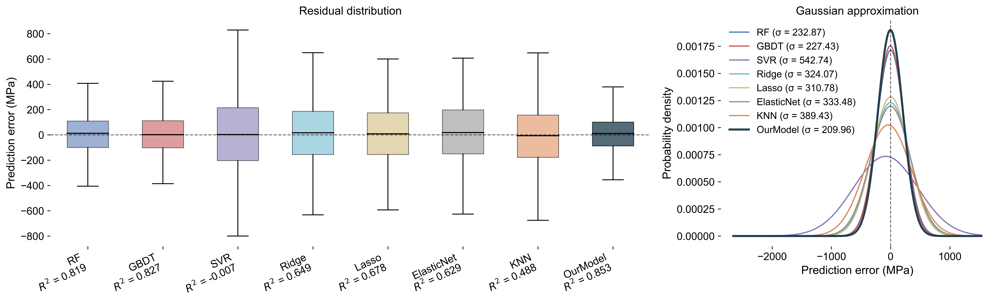
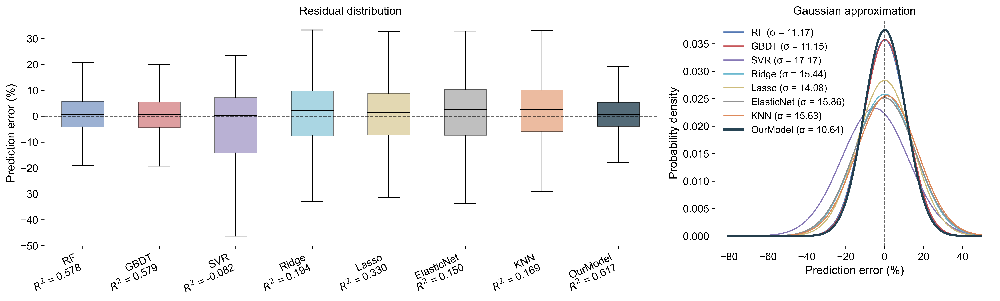

<div align="center">

# [ATON for Alloy Discovery](https://bin-cao.github.io/AlloyDiscovery/)

**Trajectory-based alloy property prediction with self-consistent inference and residual correction.**

[English](README.md) | [中文](docs/README.zh-CN.md) | [日本語](docs/README.ja.md) | [한국어](docs/README.ko.md) | [Español](docs/README.es.md) | [Deutsch](docs/README.de.md)

[](https://github.com/Bin-Cao/AlloyDiscovery/stargazers)
[](https://github.com/Bin-Cao/AlloyDiscovery/network/members)
[](https://github.com/Bin-Cao/AlloyDiscovery/issues)
[](https://bin-cao.github.io/AlloyDiscovery/)
[](https://www.python.org/)

</div>

Alloy Trajectory Optimization Network/Model (ATON/ATOM) predicts alloy mechanical properties from composition and processing descriptors:

- `Strength_MPa`
- `Plasticity_%`

The model combines a neural ATOM backbone, self-consistent trajectory inference, and an internal residual correction branch. User-facing prediction files expose only the final ATOM prediction columns.

## Results Preview

<p align="center">
  
  
</p>

The comparison notebook evaluates ATOM against RF, GBDT, SVR, Ridge, Lasso, ElasticNet, and KNN under the same five-fold out-of-fold protocol.

## Quick Start

```bash
python trainer.py
python inference.py input.xlsx predictions.xlsx --checkpoint checkpoints/model_best.pth
```

Generated training artifacts:

```text
checkpoints/model_best.pth
checkpoints/cv_oof_predictions.xlsx
checkpoints/cv_summary.json
```

Final inference columns:

```text
ATOM_Predicted_Strength_MPa
ATOM_Predicted_Plasticity_%
```

## Repository Layout

```text
data.xlsx                 Training data
trainer.py                Five-fold cross-validation training entry
inference.py              Label-free inference entry
build_search_space.py     Generate virtual search space
src/data.py               Column definitions and dataset construction
src/model.py              ATOM neural model
src/ensemble.py           Internal residual correction branch
src/train.py              Training and self-consistent prediction utilities
docs/algorithm.html       Detailed English/Chinese algorithm document
docs/README.md            Multilingual README switcher
docs/figs/plot.ipynb      Five-fold comparison plots
```

## Data Format

Training data must contain these columns:

```text
Al, Co, Cr, Fe, Ni, Ti, Mo, Nb
Eutectic, Preparation, Processing, Tensile/compress
Cold CR_%, Annealing_Temp_K, Annealing_time_h, Aging_Temp_K, Aging_Time_h
Rate_S-1, Tes_Temp_K
Strength_MPa, Plasticity_%
```

Inference data only needs feature columns. If label columns are present, `inference.py` drops them automatically.

## Training

Run from the project root:

```bash
python trainer.py
```

The cross-validation result is computed by concatenating all five held-out fold predictions, then evaluating once on the full out-of-fold prediction vector.

Useful options:

```bash
python trainer.py \
  --data data.xlsx \
  --output-dir checkpoints \
  --epochs 300 \
  --batch-size 32 \
  --lr 1e-3 \
  --patience 50 \
  --sc-max-iters 30 \
  --sc-tol 1e-3
```

## Inference

```bash
python inference.py input.xlsx predictions.xlsx --checkpoint checkpoints/model_best.pth
```

## Search Space

```bash
python build_search_space.py --data data.xlsx --output search_space.csv
python inference.py search_space.csv search_predictions.xlsx --checkpoint checkpoints/model_best.pth
```

## Model Comparison Plots

First train the model:

```bash
python trainer.py
```

Then open and run:

```text
docs/figs/plot.ipynb
```

## Use Your Own Data

1. Prepare an Excel or CSV file with the required feature columns.
2. Keep `Strength_MPa` and `Plasticity_%` only for training data.
3. Encode categorical columns as non-negative integers.
4. If your element or process columns are different, edit the column lists in `src/data.py`.
5. Train with:

```bash
python trainer.py --data your_data.xlsx
```

## Documentation

Open the full bilingual algorithm guide:

- [Online documentation](https://bin-cao.github.io/AlloyDiscovery/)
- [`docs/algorithm.html`](docs/algorithm.html)

Read this README in other languages:

- [中文](docs/README.zh-CN.md)
- [日本語](docs/README.ja.md)
- [한국어](docs/README.ko.md)
- [Español](docs/README.es.md)
- [Deutsch](docs/README.de.md)
